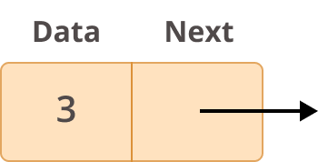

# Data Structres

## 1. Linked List

- Linked lists are an ordered collection of objects.

- Linked lists differ from lists in the way that they store elements in memory. While lists use a contiguous memory block to store references to their data, linked lists store references as part of their own elements.

### Node

- Each element of a linked list is called a __node__, and every node has two different fields:

  1. __Data__ contains the value to be stored in the node.
  2. __Next__ contains a reference to the next node on the list.

- A linked list is a collection of nodes.

- The __first node is called the head__, and it’s used as the starting point for any iteration through the list.

- The last node must have its next reference pointing to None to determine the end of the list

- A simple linked list would like this:

### Common LL methods

1. Insert at front
2. Insert at end
3. Delete at front
4. Delete at end

### FIFO_LL (Queue Implementation)

- In a linked queue, each node of the queue consists of two parts i.e. data part and the link part. Each element of the queue points to its immediate next element in the memory.

- Two main operations are used in this type of LL
    1. Insert at end
    2. Delete at front

### LIFO_LL (Stack Implementation)

- In linked list implementation of stack, the nodes are maintained non-contiguously in the memory. Each node contains a pointer to its immediate successor node in the stack.

- Two main operations are used in this type of LL
    1. Insert at front/top
    2. Delete at front

## 2. List/Array

- A list in Python is used to store the sequence of various types of data.

- Python lists are mutable type its mean we can modify its element after it created. However, Python consists of six data-types that are capable to store the sequences, but the most common and reliable type is the list.

- The main difference between python list and array is that while list can contain different data types, arrays can contains only homogenous data i.e only one data type of data.
